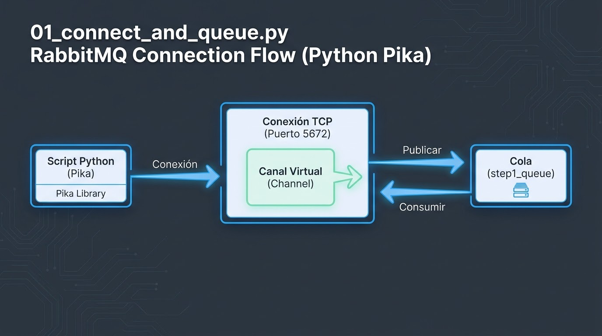
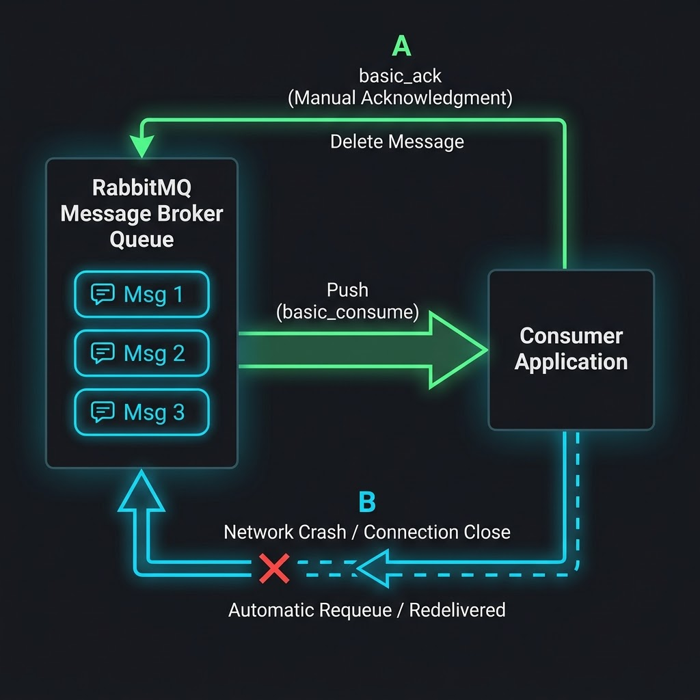
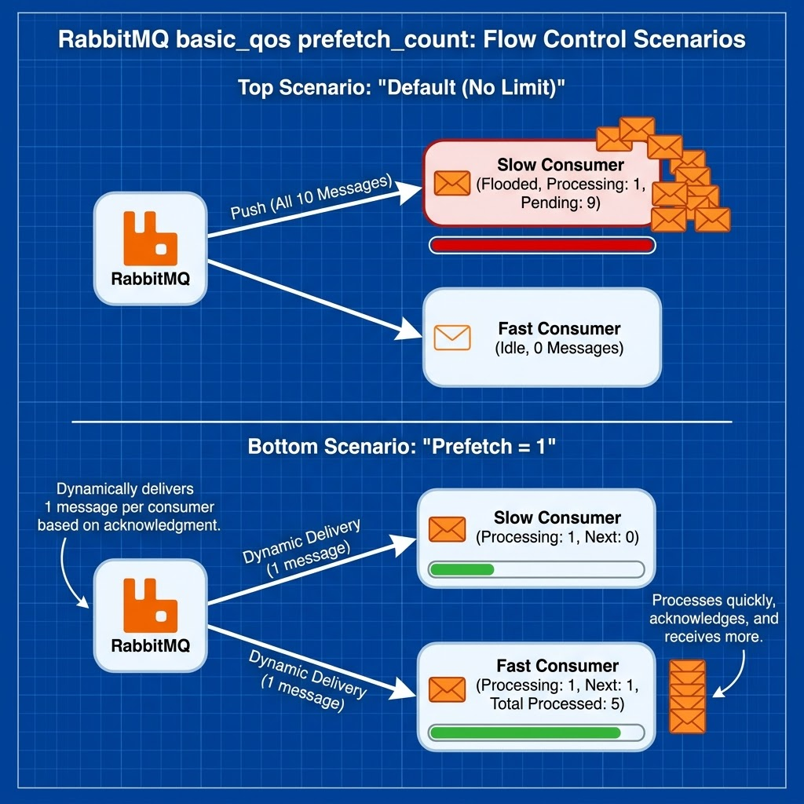
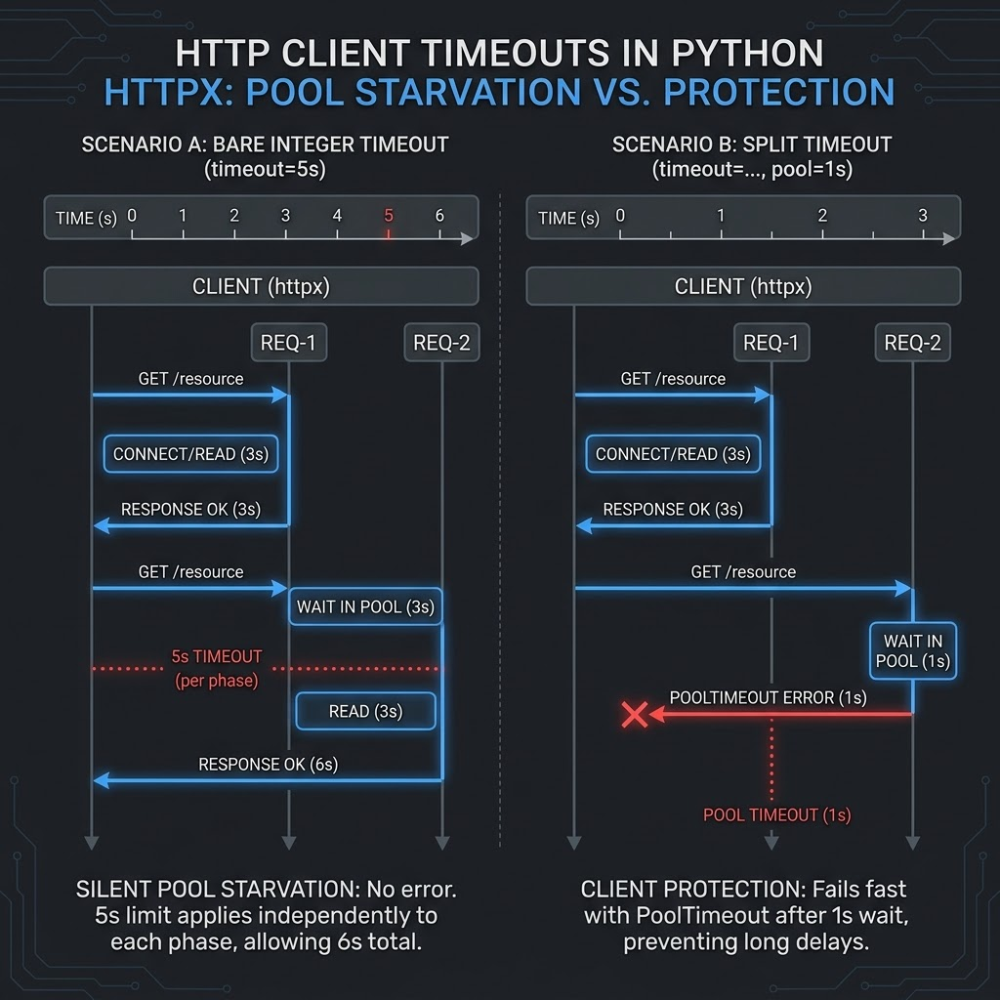
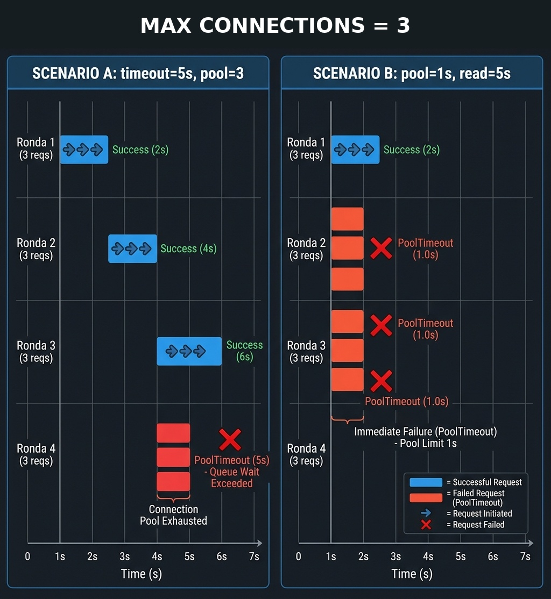

# README

Explicación breve de cada script numerado del repo. El detalle completo (plan,
progreso, output esperado) vive en `RUNBOOK.md` — esto es un resumen rápido
con capturas de la UI de RabbitMQ para orientarse antes de leer el código.

## 01_connect_and_queue.py

Lo mínimo indispensable para hablar con RabbitMQ: abrir una `Connection`, un
`Channel` sobre ella, declarar una cola (`step1_queue`), publicar un mensaje y
consumirlo de vuelta con `basic_get(auto_ack=True)`. Sin timeouts, pools ni
concurrencia todavía.

## 02_basic_consume_ack.py

Reemplaza `basic_get(auto_ack=True)` por `basic_consume` + ack manual, para
mostrar el estado intermedio "entregado pero no confirmado" (unacked) que
`auto_ack=True` se salta. En dos rondas: la ronda 1 publica 3 mensajes, ackea
el 1 y el 3, pero deja el 2 sin ackear a propósito (simulando un consumer que
muere) y cierra la conexión; la ronda 2 abre una conexión nueva y muestra que
RabbitMQ redelivera solo el mensaje 2, porque nadie lo había confirmado. Es
el mismo mecanismo que usa Celery con `acks_late=True`.

## 03_qos_prefetch.py

Introduce `basic_qos(prefetch_count=N)`: el límite de cuántos mensajes sin
confirmar puede tener un consumer a la vez. Compara dos escenarios con dos
"workers" (uno lento, uno rápido) sobre la misma cola: sin límite, el que se
suscribe primero acapara los 10 mensajes aunque sea el más lento; con
`prefetch_count=1` en ambos, RabbitMQ reparte de a un mensaje según quién va
confirmando, así que el rápido termina procesando la mayoría pero el lento
también avanza. Es el mismo mecanismo detrás de
`worker_prefetch_multiplier * concurrency` en Celery.

## 04_http_timeout.py

Ya no usa RabbitMQ: aísla un solo cliente HTTP (`httpx`) contra un servidor
propio lento, para comparar un timeout bare-int (`timeout=5`, que reparte el
mismo número a las cuatro fases connect/write/read/pool) contra un
`httpx.Timeout` con presupuestos separados. Con un pool de una sola conexión
y dos requests concurrentes, el escenario A deja que req-2 espere en
silencio su turno del pool sin ningún error (indistinguible de "el
downstream tardó más"); el escenario B, con `pool` corto y `read` generoso,
hace que req-2 falle rápido con `httpx.PoolTimeout` en vez de esperar a
ciegas.

## 05_pool_exhaustion.py

Mismo patrón que el paso 04, pero a escala real de agotamiento: un pool de 3
conexiones (`max_connections=3`) contra 12 requests concurrentes, que se
turnan en 4 rondas de 3. Escenario A (`timeout=5` bare-int): las rondas 1-3
esperan 0s/2s/4s por un slot, todas por debajo de 5s, y terminan OK; la ronda
4 necesitaría esperar ~6s, supera los 5s y sale `PoolTimeout` real — pero
marcado con el mismo número (5s) que cualquier lectura lenta legítima, así
que un log genérico de "timeout ~5s" no distingue "no había conexiones
libres" de "el downstream está lento de verdad". Escenario B
(`httpx.Timeout(pool=1, read=5, ...)`, pool corto a propósito): la ronda 1
ocupa los 3 slots los 2s completos que tarda el downstream, así que ninguna
de las rondas 2-4 llega a conseguir slot antes de que se les cumpla su
presupuesto de 1s — los 9 caen en `PoolTimeout` casi al mismo tiempo (~1s),
a una escala de tiempo muy distinta a la de un `read` lento real.

